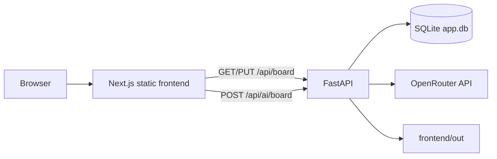
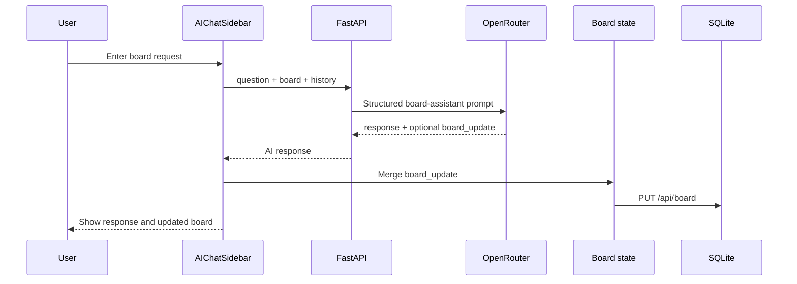

# Project Management MVP Technical Design

**Status:** Implemented MVP design
**Project:** Project Management MVP
**Date:** 2026-09-18

## 1. Purpose

The application is a local project-management MVP with a Kanban board and an AI assistant. A user signs in with a demo account, manages one persistent board, and can ask the AI assistant to create, edit, or move cards and add or rename stages.

The system is intentionally small. It is designed for local execution in Docker, one board per user, frontend-only authentication, SQLite persistence, and OpenRouter-backed AI behavior.

## 2. Scope

### Included

- Frontend-only sign-in using the hardcoded credentials `user` / `password`.
- One Kanban board for the signed-in MVP user.
- Renamable board columns.
- Create, edit, delete, reorder, and move cards.
- Drag-and-drop card movement.
- Explicit move-left and move-right card controls.
- Distinct visual colors for stages.
- Persistent board storage in SQLite as JSON.
- AI chat sidebar that can update the board without manual approval.
- AI-created columns/stages and AI-created or modified cards.
- FastAPI serving both API routes and the statically built Next.js frontend.
- Docker and Docker Compose packaging.

### Explicitly out of scope

- Production authentication, sessions, password hashing, authorization, or account management.
- Multiple boards per user.
- Multi-user UI and user administration.
- Real-time collaboration.
- Audit history or undo/redo for AI actions.
- File attachments, comments, notifications, due dates, or integrations.
- Cloud database or hosted deployment.

## 3. Design Principles

- Keep the MVP simple and easy to run locally.
- Keep board state separate from AI conversation state.
- Validate behavior with focused automated tests.
- Preserve user-created board data when applying AI updates.
- Keep external provider access on the backend; never expose the OpenRouter key to the browser.
- Prefer existing project conventions over additional abstractions.

## 4. High-Level Architecture



### Runtime model

1. The frontend is built with Next.js using static output.
2. The FastAPI application starts from `backend/app/main.py`.
3. FastAPI serves the static files from `frontend/out` at `/` when the build exists.
4. FastAPI handles `/api/*` routes.
5. SQLite is created automatically at `backend/app.db` when the application first accesses board data.
6. AI requests are sent from FastAPI to OpenRouter using `OPENROUTER_API_KEY`.

## 5. Repository Structure

```text
pm/
├── backend/
│   ├── app/
│   │   └── main.py              # FastAPI app, persistence, AI integration
│   ├── tests/test_app.py        # Backend API and AI tests
│   ├── pyproject.toml           # Python dependencies and build metadata
│   └── app.db                   # Local SQLite database, created at runtime
├── frontend/
│   ├── src/app/                 # Next.js entry page and global styles
│   ├── src/components/          # Board, columns, cards, and new-card form
│   ├── src/lib/kanban.ts        # Board types, initial data, card movement
│   ├── src/**/*.test.tsx        # Frontend component tests
│   ├── public/                  # Static frontend assets
│   └── package.json             # Node scripts and dependencies
├── docs/
│   ├── PLAN.md                  # Implementation roadmap
│   └── TECHNICAL_DESIGN.md      # This document
├── scripts/
│   ├── start.sh                 # Docker Compose build and start
│   └── stop.sh                  # Docker Compose stop
├── Dockerfile                   # Combined frontend/backend image
├── docker-compose.yml           # Local container configuration
├── .env                         # Local secrets, not committed
└── AGENTS.md                    # Product and repository requirements
```

## 6. Frontend Design

### Entry and authentication

`frontend/src/app/page.tsx` owns the MVP login gate. It compares the entered values with the hardcoded demo credentials and stores authentication state in React memory. Successful login renders `KanbanBoard`; logout returns to the login view.

This is intentionally not security. The backend currently uses the fixed MVP user identity and does not validate a browser session.

### Board composition

`KanbanBoard.tsx` owns the active board state and coordinates:

- Initial board loading from `GET /api/board`.
- Board persistence through `PUT /api/board`.
- Drag-and-drop events from `@dnd-kit`.
- Column renaming.
- Card creation, editing, deletion, and directional movement.
- AI sidebar submission and application of AI board updates.

The component tree is:

```text
Home
└── KanbanBoard
    ├── KanbanColumn
    │   ├── KanbanCard
    │   └── NewCardForm
    ├── DragOverlay
    │   └── KanbanCardPreview
    └── AIChatSidebar
```

### Board state and AI state separation

Board state is held in `KanbanBoard` as `BoardData`. AI messages and the current AI prompt are held inside `AIChatSidebar`. AI conversation growth uses an independently scrollable, fixed-height panel so it cannot change the height of the board columns.

When an AI response includes a board update, the frontend merges it into the current board:

- Existing columns returned by the AI are updated.
- New columns returned by the AI are appended.
- Card definitions are merged into the current card map.
- Card IDs included in an updated column are removed from other columns before rendering.
- Unchanged board columns and cards are retained.

### Card interactions

Each card supports:

- Drag-and-drop using `@dnd-kit/sortable`.
- Inline title and details editing.
- Icon-only delete action.
- Move-left action to the previous stage.
- Move-right action to the next stage.

The action bar is rendered inside the card, below the card content. Pointer events on the action bar stop drag activation so clicking an action does not accidentally start a drag.

### Column interactions

Columns support:

- Inline title editing.
- Drop targets for cards.
- New-card form.
- Stage-specific accent colors.

## 7. Data Model

The board is represented as JSON with normalized cards and ordered column membership.

```json
{
  "columns": [
    {
      "id": "col-backlog",
      "title": "Backlog",
      "cardIds": ["card-1", "card-2"]
    }
  ],
  "cards": {
    "card-1": {
      "id": "card-1",
      "title": "Align roadmap themes",
      "details": "Draft quarterly themes with impact statements and metrics."
    }
  }
}
```

### Type definitions

```ts
type Card = {
  id: string;
  title: string;
  details: string;
};

type Column = {
  id: string;
  title: string;
  cardIds: string[];
};

type BoardData = {
  columns: Column[];
  cards: Record<string, Card>;
};
```

### SQLite schema

The MVP uses one table:

```sql
CREATE TABLE IF NOT EXISTS board_data (
  user_id TEXT PRIMARY KEY,
  board_json TEXT NOT NULL
);
```

The `user_id` key is ready for future multiple-user support. The current frontend and backend use the default identity `user`.

The board JSON is written as one transaction through SQLite's upsert behavior:

```sql
INSERT INTO board_data (user_id, board_json)
VALUES (?, ?)
ON CONFLICT(user_id)
DO UPDATE SET board_json = excluded.board_json;
```

This is appropriate for the MVP's single-board workload. A future system with granular queries, concurrent editing, or reporting would likely normalize columns and cards into separate tables.

## 8. Backend API

### `GET /api/health`

Returns a simple service health response.

Example:

```json
{
  "status": "ok",
  "message": "Hello world from FastAPI"
}
```

### `GET /api/demo`

Returns a basic API demonstration payload used by the initial scaffold.

### `GET /api/board`

Loads the board for the default MVP user. If no row exists, the default board is inserted and returned.

### `PUT /api/board`

Accepts a board JSON object containing `columns` and `cards`, validates those top-level fields, and persists the board for the default user.

### `POST /api/ai/test`

Sends a simple question to OpenRouter. This route is used for connectivity verification and returns an answer string. It accepts both JSON and plain-text model output.

Request:

```json
{
  "question": "2+2"
}
```

### `POST /api/ai/board`

Sends the following information to OpenRouter:

- The user's current question.
- The complete board JSON.
- The current conversation history.

Request shape:

```json
{
  "question": "Move the analytics card to Review",
  "board": {
    "columns": [],
    "cards": {}
  },
  "history": [
    {
      "role": "assistant",
      "content": "Ask me to create or move cards on the board."
    }
  ]
}
```

Response shape:

```json
{
  "response": "Moved the analytics card to Review.",
  "board_update": {
    "columns": [],
    "cards": {}
  }
}
```

`board_update` is `null` when the assistant only answers a question. When a board change is requested, the system prompt asks the model to return complete `columns` and `cards` objects, preserve existing entities, and place moved card IDs in the destination column.

The backend accepts JSON responses wrapped in Markdown code fences and safely falls back to a text response if the model does not produce a JSON object.

## 9. AI Update Flow



The AI action is automatic in the MVP. There is no approval step between receiving `board_update` and applying it.

## 10. Environment and Secrets

The root `.env` file supplies:

```text
OPENROUTER_API_KEY=...
```

`load_environment()` searches from the project root upward and loads values that are not already present in the process environment. The key is read only by the backend. It must not be included in the frontend bundle, committed to source control, or printed in logs.

## 11. Container and Local Operations

### Docker image

The Dockerfile performs a combined build:

1. Starts from Python 3.13 slim.
2. Installs Node.js 20 for the frontend build.
3. Installs `uv`.
4. Runs `npm install` and `npm run build` in `frontend/`.
5. Installs the backend package and dependencies.
6. Exposes port `8000`.
7. Starts Uvicorn serving FastAPI.

### Docker Compose

`docker-compose.yml` builds the image, maps host port `8000` to container port `8000`, names the container `pm-mvp`, and passes the root `.env` file into the container.

### Start and stop

From the project root:

```bash
./scripts/start.sh
./scripts/stop.sh
```

The scripts require Docker and Docker Compose. For direct local backend development:

```bash
source .venv/bin/activate
uvicorn backend.app.main:app --host 0.0.0.0 --port 8000
```

The frontend build must exist at `frontend/out` for FastAPI to serve the full application.

## 12. Testing Strategy

### Frontend

Run from `frontend/`:

```bash
npm test -- --run
npm run lint
npm run build
```

Current coverage includes:

- Login required before board access.
- Successful login.
- Board loading and persistence API calls.
- Five-column rendering.
- Column renaming.
- Card creation and deletion.
- Card editing.
- Move-left/move-right behavior.
- Independent AI panel and board rendering.
- AI card movement between columns.
- AI-created stage rendering.
- Pure card movement logic in `kanban.test.ts`.

### Backend

Run from `backend/`:

```bash
source ../.venv/bin/activate
PYTHONPATH=. pytest tests/test_app.py -q
```

Backend coverage includes:

- Environment loading.
- Health and demo routes.
- Default board creation.
- Board persistence.
- OpenRouter request wiring.
- Plain-text AI output handling.
- Structured AI board update handling.
- Hello-world scaffold route.

### Manual smoke checks

After starting the application:

```bash
curl http://localhost:8000/api/health
curl -X POST http://localhost:8000/api/ai/test \
  -H 'Content-Type: application/json' \
  -d '{"question":"2+2"}'
```

The browser smoke path is:

1. Open `http://localhost:8000`.
2. Sign in with `user` / `password`.
3. Rename a column.
4. Add, edit, move, and delete a card.
5. Ask AI to move a card.
6. Ask AI to add a new stage.
7. Confirm the board visibly changes and remains after reload.

## 13. Error Handling and Known Limits

- If `OPENROUTER_API_KEY` is absent, AI routes return an HTTP 500 configuration error.
- OpenRouter HTTP errors currently propagate as server errors rather than being converted into a detailed user-facing provider error.
- The AI model can return imperfect instructions; the frontend merge logic reduces data loss but does not provide full schema validation.
- The backend validates only that a board payload has `columns` and `cards`; deeper board integrity validation is not implemented.
- The frontend falls back to the initial in-memory board if the board GET fails.
- Board saves are attempted after state changes, but save failures are ignored in the MVP UI.
- Authentication is not a security boundary.
- SQLite is local to the container/filesystem and is not suitable for multi-instance deployment.

## 14. Security Considerations

Current protections:

- The OpenRouter key remains server-side.
- SQL writes use parameterized values for `user_id` and board JSON.
- The AI prompt receives the current board and conversation explicitly rather than relying on hidden frontend state.
- No user-supplied SQL or shell commands are executed.

Required before production use:

- Replace frontend-only login with backend authentication and secure sessions.
- Add authorization checks to board and AI routes.
- Validate board JSON against a strict schema.
- Limit request sizes and AI history length.
- Add rate limiting and provider error handling.
- Add structured logging without secrets.
- Store secrets in a managed secret store.
- Add CSRF and transport security controls appropriate to the deployment model.

## 15. Performance and Reliability

The MVP intentionally favors simplicity:

- Board reads and writes are small JSON operations.
- The frontend saves after board state changes.
- AI requests use a 30-second HTTP timeout.
- The AI sidebar scrolls independently to prevent conversation growth from changing board layout.
- Static frontend assets are served by FastAPI after the build.

For a larger system, consider optimistic-save status, retries, background AI jobs, normalized persistence, connection pooling, and a separate frontend deployment.

## 16. Future Evolution

A likely next-stage architecture would add:

1. Backend-issued authentication and user records.
2. A board ID and explicit user-to-board relationship.
3. Schema validation with typed request/response models.
4. Versioned board updates and an audit trail for AI actions.
5. Explicit AI operation plans instead of unrestricted full-board replacement.
6. Provider abstraction to support more than OpenRouter.
7. Streaming AI responses.
8. Production database and deployment configuration.
9. End-to-end browser tests against the Dockerized application.

These changes should be introduced only when the MVP requirements justify the additional operational complexity.

## 17. Definition of Done for the Current MVP

The current design is considered implemented when:

- The application starts locally through Docker Compose.
- The login screen gates access to the board.
- The board loads and persists through FastAPI and SQLite.
- Users can rename stages and manage cards.
- Drag-and-drop and directional card movement work.
- AI can answer questions and apply card or stage updates.
- AI conversation layout does not resize the board unexpectedly.
- Frontend tests, backend tests, lint, and production build pass.
- OpenRouter credentials are supplied through environment configuration rather than source code.
